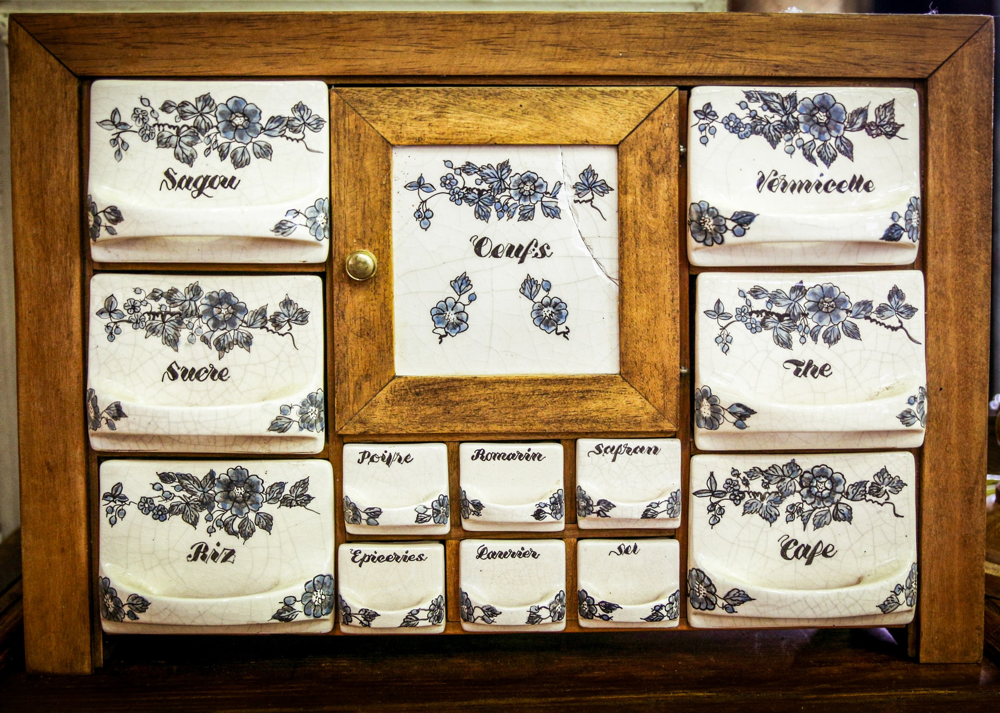

_Photo by [Flash Dantz](https://unsplash.com/@flashdantz?utm_source=unsplash&utm_medium=referral&utm_content=creditCopyText) on [Unsplash](https://unsplash.com/s/photos/drawer-mess?utm_source=unsplash&utm_medium=referral&utm_content=creditCopyText)_

# Summary

This article will quickly describe what is a hash-table and how does it work, and will serve as an explanation for the associated app.

# What is a hash-table and why do we use it?

A _hash-table_ is a data structure, i.e. it is a way to store and organize data.
The data we are speaking about is of type `key/value` pair, which means that each piece of data can be attached to a unique key.
For example, it can be the population of the biggest 10,000 cities in the world. In this case the key is the city name, the piece of data is the population. Or the age of each passenger of the Titanic (let's suppose that none of the passengers had the same name).

## What if we store everything into an array?

Storing everything into an array is the most simple solution.
Every time you have to store a new data, you increase the size of the array and put the new element at the end.

The problem with this system is that it is a bit costly to look for data.
To look for, say, the population of Mexico City, you would need to look for every item in the array to see where you stored the information.

Imagine that you put all your clothes in one big box. Then if you want the blue T-Shirt you got a the Fuji Rock festival five years ago, you need to look through all your clothes to see if this one is the T-Shirt or not.

<iframe src="https://giphy.com/embed/clupdT5vHL9GifMlnC" width="480" height="270" frameBorder="0" class="giphy-embed" allowFullScreen>
</iframe>
<a href="https://giphy.com/gifs/SWR-Kindernetz-arthur-und-die-freunde-der-tafelrunde-children-of-the-round-table-clupdT5vHL9GifMlnC">via GIPHY</a>

## Now with a hash

In order to speed up the search, we will have to find a function which associates to each data key a number, to give you a quick(er) access to data.
To look at the previous example, let's suppose you have a big walk-in closet. You sort all the T-Shirts by color, put in each drawer only T-Shirts of one color and label each drawer accordingly. In effect you have created a _hash function_ which associates to each item a reference to a place in your walk-in closet. This will speed up the search, because you won't have to look through all the T-Shirts which are not of the desired color. And in the "best case" scenario, if you just have one T-Shirt of each color, you won't even need to search. (But you need a pretty big closet).

## Back to our hash-tables

For our hash-table, the _hash function_ will be a function which takes a key and calculates an index (usually an integer) which will be used as a reference to access the data quicker. The _hash function_ could be the length of the string, or the sum of the character codes of all characters in the string, etc...
What matters though in the choice of the hash function is to minimize the number of times where two items will have the same hash value.
In our previous example, if you only have blue T-Shirts and your hash function is the color of the clothes, then you will have a lot of empty drawers and a very full drawer, which will end up not being very useful.
When two different keys end up with the same hash value, it's called a **collision**. And finding the right hash function is important in determining the number of collisions, on average. This obviously depends on the data you will be sorting, but you get the idea.

## Example

Let's say we want to use the length of a string as a hash-function.

- First, for Tokyo. The length of the name is 5, so we will put (Tokyo, 37 million) at the index "5" in our table.
- Then we want to put "Shanghai". The length is 8, so we will put (Shanghai, 25 million) at the index 8 in our table.
- Then we have "Sao Paolo". The length is 9, so we will put (Sao Paolo, 22 millions) at the index 9 in our table.

You can see that if I am looking for the population of "Shanghai", I just need to look at the hash value, (8), and I find the right data without having to compare with anything. (without a hash-table I would have had to compare to each element of the array, i.e. potentially 3 operations)

- If now I want to input "Delhi", the hash value is 5 so we have a **collision**. I need to then put (Delhi, 29 Million) in the list after Tokyo, as they share the same hash value.

Now you can see that if I want to retrieve the population of Delhi, I can have two comparisons to do, because several towns share the same hash value. You can see with this (very simple) example that the challenge is to find a hash function which minimizes the number of collisions, so that the data structure can be as efficient as possible.

## Demo time!

I made a quick demo page so that you can see how it works by yourself.

- The code is at <https://github.com/AlixFachin/hash-table-riot>
- There is a <a href="/hashTable/index.html">live demo hosted on this site</a>

I will keep working on this tool in the next weeks. Please don't hesitate to contact me if you have any suggestions/feedback.
Thanks!
