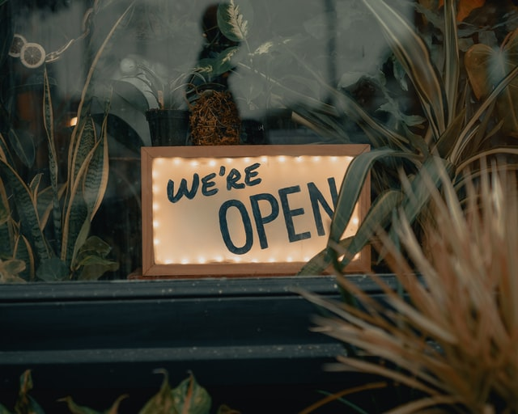

|  |
|--|
| _Photo by [Clay Banks](https://unsplash.com/@claybanks?utm_source=unsplash&utm_medium=referral&utm_content=creditCopyText) on [Unsplash](https://unsplash.com/s/photos/opening?utm_source=unsplash&utm_medium=referral&utm_content=creditCopyText)_ |
  

# A new website!

Hi everyone - today a quick blog post to announce the deployment of my portfolio website.
I hope you like it 😊

## Tech used
I wanted to build a static website quite quickly, and after looking at a few "10 best static website generators" like pages, I found out [Gatsby](https://www.gatsbyjs.com).

It drew my curiosity, as it was built in `JavaScript` using `React` and it was supposed to be lightning fast.

I then spent one week and a half to get accustomed to gatsby plugins and the way the data is stored and retrieved.

All in all I am rather happy about my choice, and there is still so much to explore! (SEO, tests, ...)💪

## Thanks to...

* Thanks to [The Net Ninja](https://www.youtube.com/c/TheNetNinja/playlists) for their great tutorial on Gatsby, slightly easier to follow than the official tutorials.
* Thanks to <mailto: david.dalbusco@outlook.com> and <mailto:nicolas@nmattia.com> for their syntax highlighter plugin <https://www.gatsbyjs.com/plugins/gatsby-remark-highlight-code/>
* Thanks to [Unsplash]<https://unsplash.com> for their picture library. (I hope I didn't forget any picture attribution)
* Vincent Garreau for <https://vincentgarreau.com/particles.js/> which is a pretty awesome background